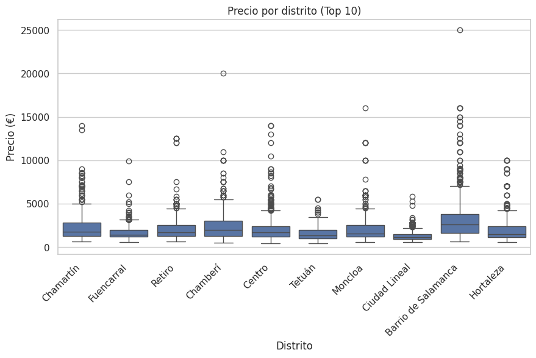

# IA aplicada al mercado inmobiliario de Madrid

**Análisis de datos, predicción de precios y procesamiento de texto con Python.**

Proyecto académico de **David Díaz Vílchez**, realizado durante su formación en Inteligencia Artificial y Data Science en UNIR. Reúne cuatro entregas: desde la exploración de anuncios hasta el entrenamiento de un modelo en un notebook de AWS SageMaker y su almacenamiento en Amazon S3.

## Qué hice

- Exploré los datos, valores ausentes y distribución de precios.
- Construí pipelines de preprocesamiento y comparé modelos de regresión y clasificación.
- Experimenté con TF-IDF, Word2Vec + CNN y fine-tuning de BERT en español.
- Trabajé con datos y artefactos de modelos en Amazon S3 desde SageMaker.

## Dos líneas de trabajo

| Entrega | Datos y objetivo | Cuaderno |
|---|---|---|
| 1 · Exploración | 9.229 anuncios de **alquiler**; análisis inicial y planteamiento del problema | [Exploración](notebooks/01_exploracion_alquileres.ipynb) |
| 2 · Modelado | Predicción de alquiler y ejercicio de clasificación de presencia de balcón | [Modelos tabulares](notebooks/02_modelos_alquileres.ipynb) |
| 3 · NLP | 11.826 anuncios de **venta**; estimación de precio a partir de títulos y etiquetas | [Experimentos de texto](notebooks/03_nlp_ventas.ipynb) |
| 4 · AWS | Regresión con variables numéricas del dataset de venta; serialización y almacenamiento en S3 | [SageMaker y S3](notebooks/04_entrenamiento_sagemaker_s3.ipynb) |

**Los hitos 1–2 y 3–4 utilizan datasets diferentes.** El último hito no despliega el Random Forest del segundo ni el BERT del tercero: es un ejercicio independiente de entrenamiento y almacenamiento en cloud. No hay una API ni un endpoint de predicción publicados.

## Resultado destacado

En la entrega de alquileres, **Random Forest obtuvo R² = 0,851 y MAE ≈ 318 €** en una partición de prueba del 20 %. Son resultados guardados en el cuaderno académico, no una nueva ejecución ni una garantía para el mercado actual.

| Modelo de alquileres | MAE (€) ↓ | RMSE (€) ↓ | R² ↑ |
|---|---:|---:|---:|
| Random Forest | 318,38 | 575,43 | 0,851 |
| Gradient Boosting | 429,39 | 700,46 | 0,780 |
| Ridge | 471,04 | 780,20 | 0,727 |
| Regresión lineal | 535,38 | 912,39 | 0,626 |

*Gráfico conservado de la entrega 2. Son precios anunciados del dataset, no precios de operaciones cerradas ni una fotografía actual del mercado.*

## Tecnologías

Python · Pandas · NumPy · Matplotlib · Seaborn · scikit-learn · TensorFlow/Keras · NLTK · Gensim · Hugging Face Transformers · PyTorch · AWS SageMaker · Amazon S3 · boto3.

## Qué aprendí

- Encapsular imputación, escalado y codificación en pipelines.
- Comparar métricas adecuadas para regresión y clasificación desbalanceada.
- Ajustar hiperparámetros mediante validación cruzada.
- Contrastar métodos clásicos con redes neuronales: en el experimento de texto, TF-IDF + Ridge superó a Word2Vec + CNN y BERT.
- Distinguir entrenar, guardar un modelo y ofrecerlo como servicio de inferencia.

## Consultar o ejecutar

Puedes leer los cuadernos y sus salidas seleccionadas directamente en GitHub. Para ejecutarlos necesitas los CSV originales: **no se redistribuyen datos, anuncios ni modelos entrenados**. La referencia exacta de descarga y licencia de los datasets está pendiente de documentar.

- [Datos necesarios y esquema](data/README.md)
- [Preparación del entorno y ejecución](docs/reproduccion.md)
- [Resultados históricos y limitaciones](docs/resultados.md)
- [Cambios realizados para publicar el portfolio](docs/preparacion_portfolio.md)

## Estado y alcance

Proyecto formativo, no servicio de tasación ni aplicación en producción. Se ha revisado la estructura de los cuadernos y el código; la preparación del portfolio no incluye volver a entrenar todos los modelos. La comprobación automática valida estructura, sintaxis y reglas de publicación, no las métricas de ML.

Los cuadernos conservan el trabajo académico con ajustes documentados de presentación, rutas y configuración. La documentación y la preparación técnica para GitHub se han realizado posteriormente con asistencia de IA. Las mejoras pendientes y las limitaciones se explican junto a los resultados.
